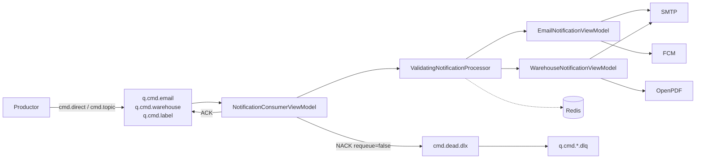

# Repository Guidelines

Monorepo del caso semestral **RutaExpress** (DSY1107 — Desarrollo Cloud Native I). Contiene un único microservicio backend implementado, `demo/`, que hace de **`ms-rutaexpress-notify`**: consumidor RabbitMQ de notificaciones (email, push y PDF), sin base de datos propia.

El caso completo define 8 servicios + frontend Angular; **solo `notify` existe**. El resto de directorios son documentación.

---

## Project Overview

**Propósito del servicio implementado:** consumir eventos de tres colas RabbitMQ y entregar notificaciones reales al destinatario (SMTP) y a bodega (ticket de picking / etiqueta de despacho en PDF), con push opcional vía Firebase.

Responsabilidades exigidas por el caso (`Caso 3 - RutaExpress.docx` §8) y ya materializadas en código:

- Envelope común: `type`, `eventId`, `timestamp`, `traceId`, `correlationId`.
- ACK/NACK explícitos.
- Idempotencia por `eventId`.
- Métrica de tasa de DLQ.

**Estado de implementación** (verificado, no asumido):

| Servicio del caso | Estado |
|---|---|
| `ms-rutaexpress-notify` (`demo/`) | Implementado |
| `shipments`, `catalog`, `report`, `audit`, `bff`, `mq-admin`, `kafka-admin` | No existen |
| `frontend-rutaexpress` (Angular + MSAL) | No existe |
| Kafka / Zookeeper | Sin dependencias ni configuración en el repo |
| `infra/` con los 3 `compose.yml` del caso | No existe |

---

## Architecture & Data Flow

Arquitectura **MVVM** dentro del paquete base `com.rutaexpress.demo`, con dependencias unidireccionales `viewmodel → view → model`; `config` es transversal.

| Capa | Responsabilidad | Clases |
|---|---|---|
| `model` | Estado y contratos de dominio; DTOs inmutables validados + puerto de idempotencia | `EventEnvelope<T>`, `EmailNotification`, `WarehouseTicket`, `ShippingLabel`, `IdempotencyStore`, `RedisIdempotencyStore` |
| `view` | Adaptadores de salida puros; **sin lógica de decisión**, no conocen RabbitMQ ni idempotencia | `EmailNotificationView` (SMTP), `PdfNotificationView` (OpenPDF), `PushNotificationView` (FCM) |
| `viewmodel` | Orquestación: validación, idempotencia, reglas de negocio, reintentos, ACK/NACK, telemetría | `ValidatingNotificationProcessor` (base abstracta), `EmailNotificationViewModel`, `WarehouseNotificationViewModel`, `NotificationConsumerViewModel` |
| `config` | Infraestructura Spring | `RabbitMqConfig`, `SecurityConfig`, `NotificationProperties` |

### Flujo de un mensaje

1. Productor externo publica en `cmd.direct` (routing key exacta) o `cmd.topic` (patrón).
2. Los bindings de `RabbitMqConfig` lo enrutan a `q.cmd.email` / `q.cmd.warehouse` / `q.cmd.label`.
3. El contenedor (`AcknowledgeMode.MANUAL`) deserializa con Jackson 3 a `EventEnvelope<T>`, infiriendo el genérico de la firma del `@RabbitListener`.
4. `NotificationConsumerViewModel.handle` captura el `deliveryTag` y ejecuta `deliverWithRetries`.
5. `ValidatingNotificationProcessor.processOnce` valida envelope + payload, reclama el `eventId` en Redis y ejecuta la acción.
6. El `*ViewModel` delega el envío real en las `*View` (SMTP / PDF adjunto / FCM).
7. Éxito → `complete` + `basicAck`. Fallo tras agotar intentos → incrementa el contador y `basicNack(requeue=false)` → `cmd.dead.dlx` → `q.cmd.*.dlq`.



### Topología RabbitMQ

Declarada **programáticamente**, no en propiedades. Fuente única de verdad: `demo/src/main/kotlin/com/rutaexpress/demo/config/RabbitMqConfig.kt`.

- Exchanges durables: `cmd.direct` (direct), `cmd.topic` (topic), `cmd.dead.dlx` (direct).
- Colas de trabajo con dead-letter configurado: `q.cmd.email`, `q.cmd.warehouse`, `q.cmd.label`.
- DLQ: `q.cmd.email.dlq`, `q.cmd.warehouse.dlq`, `q.cmd.label.dlq`.
- Routing keys directas: `email.send`, `warehouse.ticket`, `label.gen`.
- Patrones topic: `email.*`, `warehouse.#`, `label.*`.
- Las mismas colas están suscritas a **ambos** exchanges: el productor elige clave fija o jerárquica sin cambiar consumidores.
- La DLQ se enlaza reutilizando **la misma routing key del comando**, no un prefijo `error.`.

---

## Key Directories

```
Proyecto-cloud-native/                     raíz git (rama ms_notify)
├── Caso 3 - RutaExpress.docx              enunciado (ignorado por .gitignore)
├── EP1_DSY1107_Estudiante_encargo.pdf     pauta de evaluación
├── docs/dependencias-microservicios.md    dependencias por microservicio y notas de versión
└── demo/                                  ms-rutaexpress-notify
    ├── src/main/kotlin/com/rutaexpress/demo/{config,model,view,viewmodel}
    ├── src/main/resources/application.properties
    ├── src/test/kotlin/com/rutaexpress/demo/   suite completa
    ├── build.gradle.kts                   stack y dependencias
    ├── Dockerfile, compose.yml            empaquetado y stack local
    └── gradle/wrapper/                    Gradle 9.7.1
```

Otras rutas relevantes: `demo/src/test/kotlin/com/rutaexpress/demo/StubJwtDecoderConfiguration.kt` (IDaaS de prueba).

---

## Development Commands

Todos los comandos se ejecutan **desde `demo/`**.

```bash
# Windows
.\gradlew.bat test
.\gradlew.bat bootRun

# Linux/macOS
./gradlew test
./gradlew bootRun
```

| Objetivo | Comando |
|---|---|
| Compilar | `./gradlew compileKotlin` |
| Tests (18 ejecutados, 2 saltados sin Docker) | `./gradlew test` |
| Tests incluyendo Testcontainers | `RUN_DOCKER_TESTS=true ./gradlew test` |
| Arrancar en local | `./gradlew bootRun` |
| Empaquetar | `./gradlew bootJar` → `build/libs/demo-0.0.1-SNAPSHOT.jar` |
| Levantar solo infraestructura | `docker compose up -d rabbitmq redis mailpit` |
| Levantar stack completo | `docker compose up --build` |
| Construir imagen | `docker build -t ms-rutaexpress-notify .` |

**Arranque local contra compose:** las propiedades ya apuntan a `localhost`; no hace falta exportar variables de host. Para trabajar sin tokens de Azure AD:

```bash
SECURITY_ENABLED=false ./gradlew bootRun    # PowerShell: $env:SECURITY_ENABLED="false"
```

Puertos por defecto: app `8080`, RabbitMQ `5672` (UI `15672`, `guest`/`guest`), Redis `6379` sin contraseña, Mailpit SMTP `1025` (UI `8025`).

---

## Code Conventions & Common Patterns

**Lenguaje y estilo**

- Kotlin idiomático, indentación con **tabuladores**, imports ordenados alfabéticamente.
- Funciones con cuerpo de expresión (`fun x() = ...`) de forma consistente en beans y adaptadores.
- `apply { }` para construir objetos de terceros; helpers `private fun` al final de la clase.
- KDoc y comentarios solo donde aportan contexto no obvio (p. ej. por qué se añade el prefijo `ROLE_`).

**Nombres**

- Paquetes en singular y minúscula: `config`, `model`, `view`, `viewmodel`.
- Clases con sufijo de rol: `*View`, `*ViewModel`, `*Config`, `*Properties`, `*Store`.
- Constantes `SCREAMING_SNAKE_CASE` en `companion object`; `private companion object` para detalles internos (`LOGGER`, `PREFIX`, `ROLES_CLAIM`).
- Predicados booleanos con prefijo `has` (`EmailNotification.hasEmail`).
- Pruebas: nombre entre backticks, en **español**, frase verbal en 3.ª persona (`fun \`rechaza notificacion sin destinatario\`()`).

**Patrones obligatorios**

- **Inyección por constructor siempre.** No usar `@Autowired` ni inyección por campo.
- Estereotipos: `@Service` para viewmodels de negocio, `@Component` para adaptadores e infraestructura, `@Configuration` para configuración.
- DTOs como `data class` con `val` inmutables y valores por defecto para opcionales. No hay `record` de Java.
- Validación con anotaciones Jakarta y **use-site target `@field:`** sobre propiedades de constructor primario.
- Respuestas de error: lanzar excepción de dominio (`require { }`, `IllegalStateException`), nunca silenciar.
- Logging SLF4J con `LOGGER` en `private companion object` y placeholders `{}`, sin concatenación.
- Constantes de topología públicas en `RabbitMqConfig` y reutilizadas (`@RabbitListener(queues = [RabbitMqConfig.EMAIL_QUEUE])`); nunca duplicar literales en el código de producción.

**Reglas de negocio y de infraestructura que no se deben romper**

- El envelope y el payload se validan **antes** de reclamar idempotencia; un payload inválido no debe dejar la clave reclamada en Redis.
- `processOnce` libera la clave ante `RuntimeException` para permitir el reintento; marcarla como completada solo tras el éxito.
- Los reintentos son **in-process** (`deliverWithRetries` con `Thread.sleep` y backoff exponencial). **No hay `spring-retry`** en el build; no introducirlo sin razón.
- El `messageConverter` debe declarar `javaTypeMapper.addTrustedPackages(MODEL_PACKAGE)`. Sin esto, la deserialización de `EventEnvelope` falla en runtime aunque los tests unitarios pasen.
- El contenedor de escucha debe permanecer en `AcknowledgeMode.MANUAL`: el ACK/NACK explícito es un requisito del caso.

---

## Important Files

| Archivo | Por qué importa |
|---|---|
| `demo/src/main/kotlin/com/rutaexpress/demo/DemoApplication.kt` | Punto de entrada; `@EnableConfigurationProperties(NotificationProperties::class)` |
| `demo/src/main/kotlin/com/rutaexpress/demo/config/RabbitMqConfig.kt` | Topología AMQP completa, converter, contenedor MANUAL |
| `demo/src/main/kotlin/com/rutaexpress/demo/config/SecurityConfig.kt` | Dos `SecurityFilterChain` excluyentes por `rutaexpress.security.enabled` |
| `demo/src/main/kotlin/com/rutaexpress/demo/config/NotificationProperties.kt` | Config tipada validada; incluye la fórmula de backoff `delayBefore` |
| `demo/src/main/kotlin/com/rutaexpress/demo/viewmodel/NotificationConsumerViewModel.kt` | Reintentos, ACK/NACK, métrica `rutaexpress.notify.dlq.messages` |
| `demo/src/main/kotlin/com/rutaexpress/demo/viewmodel/ValidatingNotificationProcessor.kt` | Plantilla `processOnce`: validación + idempotencia |
| `demo/src/main/kotlin/com/rutaexpress/demo/model/RedisIdempotencyStore.kt` | Idempotencia: `processing` (5 min fijo) → `completed` (TTL configurable) |
| `demo/src/main/resources/application.properties` | Única configuración externa; todas las variables con `${VAR:default}` |
| `demo/build.gradle.kts` | Stack y dependencias; 3 versiones explícitas |
| `demo/compose.yml` | Stack local con healthchecks que gobiernan el orden de arranque |
| `demo/Dockerfile` | Build multi-stage, usuario no root uid 10001 |
| `demo/src/test/kotlin/com/rutaexpress/demo/StubJwtDecoderConfiguration.kt` | Reemplaza el IDaaS en pruebas |
| `docs/dependencias-microservicios.md` | Dependencias propuestas para los 8 servicios del caso |

---

## Runtime/Tooling Preferences

| Componente | Versión |
|---|---|
| Lenguaje | **Kotlin 2.3.21** (no Java) |
| JVM | Java 21 (toolchain) |
| Framework | Spring Boot 4.1.1 — Spring Framework 7.0.9, Spring Security 7.1.1 |
| Build | Gradle 9.7.1 (wrapper, Kotlin DSL). **No hay Maven** |
| Contenedores | Docker + Docker Compose v2 |

**Restricciones y trampas del stack**

- Usar el wrapper (`./gradlew`), nunca un Gradle instalado. El wrapper es `-bin` y con `retries=0`.
- Boot 4 renombró starters: `-webmvc` (no `-web`), `-security-oauth2-resource-server` (no `-oauth2-resource-server`), y los de test se dividen por tecnología (`-webmvc-test`, `-security-test`, `-amqp-test`).
- El BOM gestiona casi todo; **solo 3 dependencias llevan versión explícita**: `firebase-admin:9.10.0`, `openpdf:3.0.5`, `mockito-kotlin:6.2.2`. No añadir versiones a lo que gestiona el BOM.
- Jackson es la línea **3** (`tools.jackson`, no `com.fasterxml.jackson`). `firebase-admin` arrastra Jackson 2; no mezclar anotaciones en los DTOs propios.
- `kotlin("plugin.spring")` es obligatorio para que Spring pueda proxear clases Kotlin (finales por defecto).
- `.gitattributes` fuerza `eol=lf` en `gradlew`: imprescindible para que el `./gradlew bootJar` del Dockerfile funcione desde un checkout en Windows. No modificar.
- Testcontainers 2.x usa módulos renombrados: `testcontainers-rabbitmq` (los nombres antiguos no existen).
- El `.gitignore` raíz solo ignora el `.docx` del caso. Si se añaden artefactos nuevos, verificar qué queda sin versionar.

**Advertencia sobre la documentación:** `docs/dependencias-microservicios.md` §5 lista `spring-retry` y `lombok` para `notify`. **Ninguna de las dos está en `demo/build.gradle.kts` ni se usa en el código.** Los reintentos están implementados a mano. Ese documento describe el diseño propuesto, no el build real.

---

## Testing & QA

**Stack de pruebas**

- **JUnit Jupiter 6.0.3** (paquetes `org.junit.jupiter.*`), AssertJ 3.27.7, Mockito 5.23.0 + Mockito-Kotlin 6.2.2, Awaitility 4.3.0, Testcontainers 2.0.5, MockMvc.
- `demo/src/test/kotlin/...` — **no existe `src/test/resources/`**: no hay perfil de test ni `application-test.properties`. La configuración se pasa inline en cada `@SpringBootTest`.

**Niveles**

| Nivel | Archivos | Requisitos |
|---|---|---|
| Unitario puro (13 tests) | `NotificationViewModelTests`, `NotificationConsumerTests`, `RabbitMqConfigTests` | Nada; colaboradores mockeados, `Validator`/`SimpleMeterRegistry`/OpenPDF reales |
| Contexto Spring (5 tests) | `DemoApplicationTests`, `SecurityTests` | Sin servicios externos; listeners AMQP apagados y health de rabbit/redis/mail desactivados |
| Integración (2 tests) | `RabbitMqIntegrationTests` | Docker + **`RUN_DOCKER_TESTS=true`** |

**Ejecución**

```bash
./gradlew test                              # 18 tests; los 2 de integración se saltan
RUN_DOCKER_TESTS=true ./gradlew test        # 20 tests, con broker real
./gradlew test --tests "com.rutaexpress.demo.RabbitMqIntegrationTests"
```

`@EnabledIfEnvironmentVariable(named = "RUN_DOCKER_TESTS", matches = "true")` es una **regex**: el valor debe ser exactamente `true`. Sin la variable, la clase se omite sin arrancar el contenedor; con la variable pero sin daemon Docker, la clase **falla** (no hay skip elegante por ausencia de Docker).

**Cómo se simula el IDaaS**

`StubJwtDecoderConfiguration` es una `@Configuration` en el paquete escaneado (no `@TestConfiguration`): sustituye el bean `JwtDecoder` en **todos** los tests con contexto. El valor literal del token es el rol:

| `Authorization: Bearer <valor>` | Claim `roles` | `/actuator/prometheus` |
|---|---|---|
| `admin` | `["Admin"]` | 200 |
| `operator` | `["Operador del dominio"]` | 403 |
| cualquier otro | `[]` | 403 |

No se valida firma, issuer, audience ni expiración. Ninguna petición de test toca `login.microsoftonline.com`.

**Qué verifica la integración contra el broker real**

Colas declaradas (`RabbitAdmin.getQueueInfo`), routing keys de origen de los tres exchanges vía la API de management de RabbitMQ, y el flujo end-to-end publicación → reintento → DLQ con el contador de Micrometer incrementado.

**Expectativas al cambiar código**

- Ejecutar `./gradlew test` antes de dar algo por terminado. Si se toca la topología AMQP, el consumidor o el converter, ejecutar también con `RUN_DOCKER_TESTS=true`.
- Toda prueba nueva debe defender comportamiento observable (estados, transiciones, errores reales), no el cableado ni los valores por defecto.
- Reutilizar los dobles en memoria ya existentes (`InMemoryIdempotencyStore` en `NotificationViewModelTests`) en vez de crear infraestructura.
- Los tests fijan contratos con literales a propósito en `RabbitMqConfigTests`; si cambia un nombre de cola o routing key, hay que actualizar ese archivo y `RabbitMqConfig.kt` juntos.
- Sin cobertura actual: `RedisIdempotencyStore` contra Redis real, las vistas SMTP/Firebase, `consumeWarehouseTicket` y `consumeLabel`, y la política de backoff.

---

## Discrepancias conocidas con los documentos

Registradas para no re-descubrirlas:

1. **Lenguaje:** la pauta `EP1_DSY1107` exige «microservicios construidos en **Java** con Spring Boot»; la implementación es Kotlin sobre JVM 21. Mismo stack y mismo bytecode objetivo, distinto lenguaje.
2. **Sistema:** la pauta describe «Pedidos360»; el caso es «RutaExpress».
3. **Errata del caso:** §6 dice `ms-campuslab-bff`; §5 y §7 dicen `ms-rutaexpress-bff`.
4. **Propiedad del issuer:** el caso escribe `security.oauth2.resourceserver.jwt.issuer-uri`; la correcta, ya usada en el código, es `spring.security.oauth2.resourceserver.jwt.issuer-uri`.
5. **Cluster RabbitMQ:** el caso pide 2 nodos; `demo/compose.yml` define 1.
6. **Naming:** el servicio se llama `ms-rutaexpress-notify` pero vive en `demo/` con paquete `com.rutaexpress.demo`, herencia de Spring Initializr.
7. **Anomalía de layout:** `RabbitMqConfigTests.kt` declara `package com.rutaexpress.demo.config` pero está en `demo/src/test/kotlin/com/rutaexpress/demo/`.
